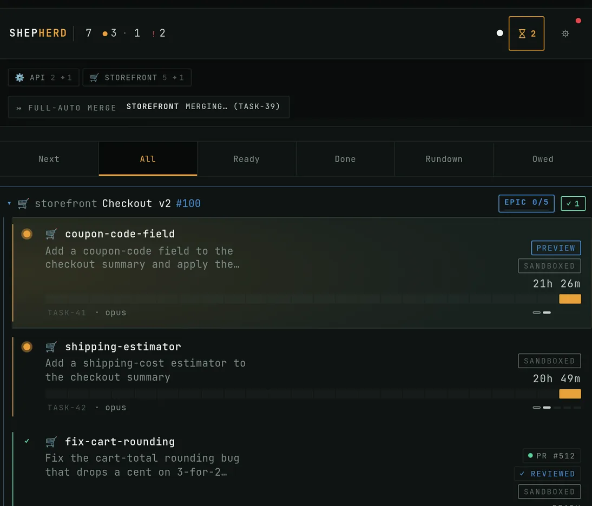

# Shepherd

[](https://github.com/erwins-enkel/shepherd/actions/workflows/ci.yml)
[](https://github.com/erwins-enkel/shepherd/releases)
[](./LICENSE)

> Self-hosted mission control for **interactive** AI coding CLIs — and opinionated about how
> agent-built software should ship. Spawn, watch, and steer a herd of real `claude` sessions (with
> the Codex CLI in alpha) from your browser or phone, with best-practice guardrails built in. On
> your own server, on your own subscription.

<p align="center">
  <a href="https://shepherd.run">
    
  </a>
</p>

[](https://github.com/erwins-enkel/shepherd/discussions)

Shepherd spawns genuine interactive `claude` sessions (and, in alpha, `codex` sessions) in isolated
git worktrees (via [`herdr`](https://herdr.dev), the interactive-pane manager), bridges each PTY to an `xterm.js` pane in
the browser, and lets one operator run many agents in parallel — observing their status and steering
them by typing, exactly like a human at a terminal. Around those sessions it adds the engineering
discipline that parallel agent work otherwise erodes: every plan and PR faces adversarial review,
and nothing merges while behind its base — a stale PR is sent back to its agent to rebase, and CI and the critic re-run first.

<p align="center">
  <video
    src="https://github.com/user-attachments/assets/bb88eabc-fdb5-4ff1-bec8-cf9c859d01e9"
    poster="docs/media/shepherd-explainer-poster.png"
    controls
    muted
    width="720"
  ></video>
  <br>
  <em>▶ 30-second explainer — how a task moves from issue to merge, and why it stops
  (<a href="docs/media/shepherd-explainer.mp4">download</a> ·
  <a href="docs/media/shepherd-explainer.en.srt">captions</a> ·
  <a href="docs/media/explainer/">source</a>).</em>
</p>

## Opinionated by design

Running many agents is the easy half; keeping their output shippable is the actual product.
Shepherd institutionalizes the practices a careful team would otherwise have to enforce by hand,
as per-repo automation:

- **Readiness** — Shepherd scores a JS/TS repo's guardrails (typecheck, lint, tests, CI, house
  rules) before you point agents at it, and prescribes the gaps as setup tasks you seed with a click.
- **Plan gate** — before an autonomous run, the agent writes a plan and a separate read-only
  reviewer grills it adversarially; only a plan that survives review is released to implement.
- **Critic** — the moment a PR's CI goes green, an isolated read-only agent reviews the full diff
  and posts a verdict; with Auto-Address on, findings flow back to the authoring agent until the
  list comes back empty.
- **Learnings** — Shepherd distills past sessions' failure signals into proposed house rules; the
  ones you approve are injected into every new agent in the repo, so lessons compound instead of
  repeating.
- **Merge train** — a finished PR lands only when it is open, CI-green, conflict-free, and up to
  date with the base branch; one that has fallen behind is sent back to its agent to rebase, and
  CI and the critic re-run before it can land.
- **Hygiene gates** — CI and the pre-push hook enforce linear branches, locale-catalog parity,
  feature-catalog completeness, and a dead-code/complexity audit
  (see [CONTRIBUTING.md](./CONTRIBUTING.md)).

Shepherd's own repo ships behind the same bar. All of it obeys the same constraint as the rest of
the product: it works by observing and typing into real terminals — see the compliance model below.

## ToS compliance model

This is the defining constraint, not a footnote. Shepherd runs on the operator's own Claude
subscription, so it **only drives interactive terminal sessions** — it never uses the Agent SDK or
`claude -p`. It observes (reads the terminal + agent status) and steers (injects keystrokes into the
live pane). Auth is the operator's own login; no token relay, no impersonation, single operator.

The Codex CLI (alpha) is driven the same way — a genuine interactive terminal session, never a
headless or scripted invocation.

If a feature can't be done by typing into a real terminal, it doesn't ship. See `PRD.md` for the
full rationale.

Operators who prefer a clearly-compliant path can opt into **API-key auth** in Settings
→ Session. In this mode Shepherd still drives genuine interactive `claude` sessions (NOT `claude -p`
/ Agent SDK); only the auth changes from subscription OAuth to a metered Anthropic API key under the
Commercial Terms, which explicitly permits automated use and is no-train-by-default.

## Your `/commands` come with you

Because Shepherd attaches to a **genuine interactive `claude` session** running against your own
`~/.claude`, every slash command you already use locally is available — your project and user
commands, installed plugins, skills, and the relevant built-ins. The cloud Claude Code (web at
claude.ai/code, the mobile app) runs in a managed environment that doesn't carry your local command
setup, so this surface simply isn't there.

The New Task prompt makes it first-class: type `/` at the start and a filtered dropdown of your
actual commands appears (the same index the Commands tab uses), each row showing its
`argument-hint` and source (project · user · plugin · builtin). Arrow keys + Enter/Tab to pick, Esc
to close — so you don't switch tabs or memorize names. It's the full local Claude Code experience,
driven from your browser or phone.

## Architecture

```
Browser / PWA  ──  SvelteKit 5 + Tailwind 4 SPA (ui/)
      │             task list · status lights · xterm.js pane · TODO + Issues panels
      │  REST + WebSocket (PTY bytes, live events)
Shepherd core  ──  Bun + TypeScript (src/)
      │             spawns/steers claude via herdr · bridges PTY → browser · SQLite session store
      ▼
   herdr  ──  owns the real claude PTYs (sessions survive a core restart)
```

- **Backend** (`src/`): Bun/TS HTTP + WebSocket server. Sessions persisted in SQLite
  (`~/.shepherd/shepherd.db`); `herdr` owns the PTYs so sessions reconcile on restart.
- **Frontend** (`ui/`): SvelteKit 5 SPA (static adapter), served from `ui/build` by the core.
- **PTY bridge**: `node-pty` is broken under Bun, so the PTY attaches in a Node helper subprocess
  (`src/pty-attach.mjs`) — never import `node-pty` from Bun.

## Install

```bash
curl -fsSL https://raw.githubusercontent.com/erwins-enkel/shepherd/main/deploy/install.sh | bash
```

Provisions prerequisites, clones to `~/.shepherd/app`, builds the UI, and on Linux installs and
enables the systemd user service. Idempotent — safe to re-run: it never clobbers an existing
`~/.shepherd/` state dir and never force-resets a dirty checkout.

### `curl|bash` trust note

This is third-party `curl|bash`: the script runs unconfined as your user _before_ any sandbox
exists. It also invokes upstream installers it does not control — specifically: [bun.sh](https://bun.sh/install),
[fnm.vercel.app](https://fnm.vercel.app) (Node via fnm), [herdr.dev](https://herdr.dev) (herdr), and
[claude.ai](https://claude.ai/install.sh) (the `claude` CLI), plus your distro's package manager
(`apt` / `apk` / `dnf` / `pacman`) for `git`, `unzip`, and the C/C++ build toolchain + `python3`
(needed for the node-pty native build).

> **Pin herdr to 0.7.4 — do not upgrade to 0.7.5+ yet.** herdr 0.7.5 reshaped `agent start` and
> Shepherd can no longer spawn agents on it (every spawn fails). Shepherd warns loudly at startup
> and blocks its in-app herdr updater on 0.7.5+ until [issue #1889](https://github.com/erwins-enkel/shepherd/issues/1889)
> ships a compatible spawn path.

In keeping with Shepherd's radical-transparency posture the script echoes each third-party command
before running it. Read the script first:
[deploy/install.sh](https://github.com/erwins-enkel/shepherd/blob/main/deploy/install.sh)

### OS matrix

| OS                                        | Mode                 | Notes                                                                                                                                                                                                                                                                                                                                                                                |
| ----------------------------------------- | -------------------- | ------------------------------------------------------------------------------------------------------------------------------------------------------------------------------------------------------------------------------------------------------------------------------------------------------------------------------------------------------------------------------------ |
| **Linux (systemd + unprivileged userns)** | Full                 | The only fully supported target. Includes the sandbox membrane, egress allowlist, auto-drain, tailscale-serve previews, and the systemd user unit. The automated install-proof gate (`install-e2e`) runs here.                                                                                                                                                                       |
| **macOS**                                 | Core-only / degraded | Installs prereqs, clones, and builds the UI. Prints a loud degraded banner. **No** sandbox membrane, egress allowlist, auto-drain, or tailscale-serve previews. **No systemd unit** — run `bun run start` manually. No automated install proof. The `herdr`/`claude` installers drop binaries in `~/.local/bin` — make sure it's on your `PATH` (see [Requirements](#requirements)). |
| **Windows**                               | Not supported        | The installer refuses and routes you to **WSL2** (a Linux distro under Windows Subsystem for Linux).                                                                                                                                                                                                                                                                                 |

### Environment knobs

| Variable              | Default           | Purpose                                                                                       |
| --------------------- | ----------------- | --------------------------------------------------------------------------------------------- |
| `SHEPHERD_DIR`        | `~/.shepherd/app` | Where the repo is cloned / found                                                              |
| `SHEPHERD_REF`        | `main`            | Git ref to clone or check out                                                                 |
| `SHEPHERD_SRC`        | _(none)_          | Install from a local tarball or directory instead of cloning (used by the onboarding harness) |
| `SHEPHERD_NO_SERVICE` | _(none)_          | Skip the systemd unit step (set automatically on macOS)                                       |

### External testers

Shepherd's GitHub repo is public, so the `curl|bash` one-liner above works for an external tester
directly — both the raw `install.sh` URL and the `git clone` it performs are anonymous, needing no
token and no collaborator grant. Point testers at that one-liner; the rest of this section covers two
special cases where it doesn't fit.

**Air-gapped tarball (no GitHub access at all).** For a fully offline machine, the installer can land
the source from a local tarball via `SHEPHERD_SRC` instead of cloning — nothing to reach GitHub for:

```bash
# maintainer — build a source tarball from the current checkout:
git archive --format=tar.gz -o shepherd.tar.gz HEAD
# send shepherd.tar.gz to the tester (install.sh lives inside it at deploy/install.sh)

# tester — extract just the installer, then run it against the tarball:
tar -xzf ~/shepherd.tar.gz deploy/install.sh
SHEPHERD_SRC=~/shepherd.tar.gz bash deploy/install.sh
```

`git archive` ships tracked files only; that's sufficient, since the installer runs `bun install`
and builds from source. Trade-off: no in-place updates — each new build is a fresh tarball.

**Pinned version (self-serve, versioned).** Every merge of the release-please PR cuts a tagged
GitHub release, and GitHub auto-generates a source tarball for each tag. Since the repo is public,
the source archive downloads anonymously — no token — and the tester feeds it to `SHEPHERD_SRC`:

```bash
# tester — anonymous, no auth: fetch the source archive for a tag straight from codeload:
curl -fL https://github.com/erwins-enkel/shepherd/archive/refs/tags/v1.41.0.tar.gz \
  -o shepherd-1.41.0.tar.gz

# …or, if you already have `gh auth login` done, the gh CLI is a convenience:
gh release download v1.41.0 --archive=tar.gz -R erwins-enkel/shepherd   # → shepherd-1.41.0.tar.gz

# GitHub archives nest everything under a top-level dir — strip it and install from
# the extracted directory (SHEPHERD_SRC accepts a directory as well as a tarball):
mkdir -p ~/shepherd-src && tar -xzf shepherd-1.41.0.tar.gz --strip-components=1 -C ~/shepherd-src
SHEPHERD_SRC=~/shepherd-src bash ~/shepherd-src/deploy/install.sh
```

Testers self-serve any tagged version and re-download to update. For ongoing updates on `main`
instead, the anonymous `curl|bash` one-liner above installs a clone that `update.sh` / `git pull`
keeps current. Either way, full support is Linux + systemd (see the [OS matrix](#os-matrix) above) —
put testers on Linux to exercise the real sandbox membrane.

### Finish setup

The installer never runs commands that need a human secret. After it completes, log in:

```bash
claude              # sign in with your Max/Pro subscription (or configure API-key auth in Settings → Session)
gh auth login       # GitHub integration (PR list, merge, redeploy)

# remote access via Tailscale
tailscale serve --bg 7330
# then add the tailnet hostname to SHEPHERD_ALLOWED_HOSTS (in ~/.shepherd/env or deploy/shepherd.service)
```

The HUD is gated by a **single-operator password**. Set it with `SHEPHERD_PASSWORD`
in `~/.shepherd/env`, or use the strong password Shepherd auto-generates on first
boot and prints to the server log **once** (`systemctl --user status shepherd` /
`journalctl --user -u shepherd`). Browser sessions use this password login;
machine clients can use `SHEPHERD_TOKEN` instead.

Settings → DIAGNOSE surfaces any remaining gaps with one-click fixes.

For the from-clone / development path, see [Quick start](#quick-start) below.

## Requirements

- [Bun](https://bun.sh) — backend runtime + package manager
- `herdr` on `PATH` — manages the interactive `claude` panes (owns the PTYs)
  - On macOS, `herdr.dev/install.sh` installs to `~/.local/bin` by default — add it to your shell
    profile before `bun run start`: `export PATH="$HOME/.local/bin:$PATH"`
- The `claude` CLI, logged in with your Max/Pro subscription
- Node.js — for the PTY helper subprocess

## Quick start

```bash
# 1. install deps (root + ui)
bun install
cd ui && bun install && cd ..

# 2. build the SPA (the core serves it statically from ui/build)
cd ui && bun run build && cd ..

# 3. run the core
bun run start
# → shepherd core on http://localhost:7330
```

Open <http://localhost:7330>. The first load shows the single-operator password
screen; set `SHEPHERD_PASSWORD`, or use the auto-generated password printed once
in the server log. To expose it (e.g. via Tailscale), set
`SHEPHERD_ALLOWED_HOSTS` to include the public hostname (see below).

## Configuration

All via environment variables (`src/config.ts`):

| Variable                           | Default                         | Purpose                                                                                                                                                                                                                                                                                                                                                                                                                                                                                                                                                                                                                                                |
| ---------------------------------- | ------------------------------- | ------------------------------------------------------------------------------------------------------------------------------------------------------------------------------------------------------------------------------------------------------------------------------------------------------------------------------------------------------------------------------------------------------------------------------------------------------------------------------------------------------------------------------------------------------------------------------------------------------------------------------------------------------ |
| `SHEPHERD_PORT`                    | `7330`                          | HTTP/WS listen port                                                                                                                                                                                                                                                                                                                                                                                                                                                                                                                                                                                                                                    |
| `SHEPHERD_HOST`                    | `127.0.0.1`                     | Bind address; loopback-only by default (set `0.0.0.0` to expose all NICs)                                                                                                                                                                                                                                                                                                                                                                                                                                                                                                                                                                              |
| `SHEPHERD_AGENT_INGRESS_PORT`      | `SHEPHERD_PORT + 1` (e.g. 7331) | Pinned loopback port for the auth-exempt agent-ingress listener (hook + build-queue callbacks). Stable so the URL baked into a live agent survives restarts/deploys; must not collide with the main port, served port, or preview range (validated at startup). Set `0` for an ephemeral port (pre-#1083 behavior).                                                                                                                                                                                                                                                                                                                                    |
| `SHEPHERD_DB`                      | `~/.shepherd/shepherd.db`       | SQLite session store path                                                                                                                                                                                                                                                                                                                                                                                                                                                                                                                                                                                                                              |
| `SHEPHERD_REPO_ROOT`               | `~` (home)                      | Repos must live under this root (spawn is confined to it)                                                                                                                                                                                                                                                                                                                                                                                                                                                                                                                                                                                              |
| `SHEPHERD_ALLOWED_HOSTS`           | `localhost,127.0.0.1,::1,[::1]` | Comma-separated origin hostnames allowed for writes + WS (CSRF/CSWSH guard)                                                                                                                                                                                                                                                                                                                                                                                                                                                                                                                                                                            |
| `SHEPHERD_PASSWORD`                | _(auto-generated)_              | Single-operator login password. When set, it is authoritative and re-seeded into the persisted password hash every boot. Unset → Shepherd reuses the persisted hash, or on first boot generates a strong password, stores its hash, and prints the password to the server log **once**. Browser operators exchange it for a signed session cookie.                                                                                                                                                                                                                                                                                                     |
| `SHEPHERD_COOKIE_SECRET`           | _(generated + persisted)_       | HMAC secret that signs the browser session cookie. Set it to keep sessions stable across DB resets; rotating it invalidates every outstanding browser session.                                                                                                                                                                                                                                                                                                                                                                                                                                                                                         |
| `SHEPHERD_TOKEN`                   | _(none)_                        | Optional bearer for CLI/curl/machine clients. When set, `Authorization: Bearer <token>` is accepted as an alternative to the browser session cookie; spawned agents use the loopback ingress instead.                                                                                                                                                                                                                                                                                                                                                                                                                                                  |
| `HERDR_BIN`                        | `herdr`                         | Path to the herdr binary                                                                                                                                                                                                                                                                                                                                                                                                                                                                                                                                                                                                                               |
| `HERDR_SESSION`                    | `default`                       | herdr session name                                                                                                                                                                                                                                                                                                                                                                                                                                                                                                                                                                                                                                     |
| `SHEPHERD_FORGES`                  | `~/.shepherd/forges.json`       | Path to the git-host config (see [Git host integration](#git-host-integration))                                                                                                                                                                                                                                                                                                                                                                                                                                                                                                                                                                        |
| `SHEPHERD_PREVIEW_PORT_BASE`       | `8001`                          | First port in the live-preview range (each agent's preview gets one port)                                                                                                                                                                                                                                                                                                                                                                                                                                                                                                                                                                              |
| `SHEPHERD_PREVIEW_PORT_COUNT`      | `16`                            | Size of the preview range and maximum concurrent previews                                                                                                                                                                                                                                                                                                                                                                                                                                                                                                                                                                                              |
| `SHEPHERD_PREVIEW_SWEEP_MS`        | `4000`                          | Cadence (ms) of the dev-port detection sweep across active sessions                                                                                                                                                                                                                                                                                                                                                                                                                                                                                                                                                                                    |
| `SHEPHERD_PREVIEW_AUTO_SERVE`      | `true`                          | Dynamically register/unregister `tailscale serve` mappings as previews bind/tear down; set `0` to map the range manually                                                                                                                                                                                                                                                                                                                                                                                                                                                                                                                               |
| `SHEPHERD_PREVIEW_IDLE_STOP_MS`    | `0` (disabled)                  | When > 0, a previewed dev server with no proxy traffic for this many ms whose agent is also idle is stopped (SIGTERM→SIGKILL) to reclaim RAM; no auto-wake (restart manually); suggested value `1800000` (30 min). "No traffic" counts only requests through the preview proxy — an idle agent hitting its own `localhost:<port>` directly is not seen, but the idle/done gate keeps it from firing on a server the agent is actively using. Only the process listening on the dev port is killed (the RAM-heavy bundler/server, so most memory is freed); a lightweight parent wrapper like `npm run dev` may linger until the agent's shell reaps it |
| `SHEPHERD_TRIM_AUTO_CONTEXT`       | `true`                          | Trim the per-turn context of auto-spawned (drain) agents: they launch with `--disable-slash-commands` (drops the skill catalog) and every optional plugin disabled per-spawn (drops plugin hook injections, skills, and MCP) — overhead unattended agents never use. Interactive sessions are untouched. Set `false`/`0`/`off` as the escape hatch if drain quality regresses                                                                                                                                                                                                                                                                          |
| `SHEPHERD_SANDBOX_DEFAULT_PROFILE` | `trusted`                       | Default sandbox profile applied to every spawned agent unless overridden per-repo in Settings. `trusted` = no sandbox (today's behavior); `standard` = filesystem/process membrane (see below); `autonomous` = same membrane, required for `auto=true` drain/autopilot sessions. Set to `standard` or `autonomous` to sandbox all agents by default                                                                                                                                                                                                                                                                                                    |

### Per-agent sandbox / permission profiles

Shepherd can wrap each spawned `claude` process in an OS-level filesystem/process sandbox via **bubblewrap (`bwrap`)**. Three profiles are available and selectable per-repo in the repo's Settings panel or globally via `SHEPHERD_SANDBOX_DEFAULT_PROFILE`:

| Profile      | Sandbox                               | Notes                                                                                                                                                                                                                                                                                                                                                                                                                                                                                                                                                                                                                                                     |
| ------------ | ------------------------------------- | --------------------------------------------------------------------------------------------------------------------------------------------------------------------------------------------------------------------------------------------------------------------------------------------------------------------------------------------------------------------------------------------------------------------------------------------------------------------------------------------------------------------------------------------------------------------------------------------------------------------------------------------------------- |
| `trusted`    | None                                  | Default; today's behavior. Use as an escape hatch when the membrane causes problems.                                                                                                                                                                                                                                                                                                                                                                                                                                                                                                                                                                      |
| `standard`   | bwrap membrane                        | Agent confined to its worktree + git object store + read-only `~/.claude`; blocks `~/.ssh`, `~/.aws`, sibling repos, and other `$HOME` dotfiles, and clears inherited env secrets; no privilege escalation. (The `gh` and `claude` auth tokens it needs stay readable, and `standard` does **not** restrict network egress — see the egress note below.) Opt-in for interactive sessions.                                                                                                                                                                                                                                                                 |
| `autonomous` | bwrap membrane **+ egress allowlist** | Same filesystem/process membrane as `standard`, **plus** network-egress confinement — outbound is restricted to an allowlist (Anthropic + the forge host + operator extras), all other outbound blocked; this is the defining difference from `standard`. Egress is tied to the **profile**, not to `auto=true`: interactive `autonomous` sessions are confined too, degrading to unrestricted egress with an operator-visible banner if the netns backend is missing, while `auto=true` (drain/autopilot) spawns are refused outright without it. **Required for `auto=true` sessions** — Shepherd refuses to auto-spawn an agent with a weaker profile. |

**Network egress is allowlist-confined for the `autonomous` profile** — shipped in [PR #601](https://github.com/erwins-enkel/shepherd/pull/601), which closed [#551](https://github.com/erwins-enkel/shepherd/issues/551). An `autonomous` agent runs inside a rootless network namespace where dnsmasq resolves **only** allowlisted domains (pinning the resolved IPs into an nftables set) and nft rejects all other outbound. The allowlist is `api.anthropic.com` + `statsig.anthropic.com`, the GitHub well-known hosts (`github.com`, `api.github.com`, `codeload.github.com`, `objects.githubusercontent.com`, `uploads.github.com`) when a GitHub forge is configured or none is configured at all (Shepherd's default), each configured forge's own host (a Gitea/Forgejo-only config gets its host, not GitHub's), and operator extras. This is profile-tied, not `auto=true`-tied: interactive `autonomous` sessions are confined too, degrading to unrestricted egress **with an operator-visible banner** when the netns backend is missing, while `auto=true` (drain/autopilot) spawns are _refused_ outright without it. `standard` is **not** egress-confined — it stays filesystem-confined only, outbound open. The membrane still keeps the `~/.config/gh` token and `~/.claude` OAuth credentials readable (the agent needs them to push and to talk to Anthropic), but under `autonomous` that readability is now **defence-in-depth**, not an open exfil channel: outbound can no longer reach an arbitrary host. One honest residual remains — wherever a forge host is allowlisted (GitHub by default), a hijacked `autonomous` agent could still push to an attacker-controlled repo on that host; and `standard` keeps the original unrestricted-egress exposure. See [`docs/sandbox-security.md`](docs/sandbox-security.md) for the full residual posture — the accepted in-membrane token-readability gap (R3) and the prompt-injection posture incl. the deliberately egress-unconfined research surface (R4).

**Backend requirements:** `bwrap` must be installed and unprivileged user namespaces must be enabled on the host. Shepherd runs a self-test at startup; when no sandbox backend is available, manually spawned sessions degrade to unconfined **with an operator-visible banner**, and `auto=true` spawns are refused until a capable host is used.

**Known constraints:**

- SSH-remote repos cannot `git push` from inside the membrane (the `~/.ssh` key dir is excluded). Use an HTTPS remote with the `gh` token instead.
- MCP servers whose dependencies live outside the bound `$HOME` paths (e.g. a server installed in an arbitrary prefix) may fail to load inside the membrane.
- The membrane relies on **OAuth/subscription auth** (`~/.claude/.credentials.json`, which it binds) in the default **subscription mode**. `--clearenv` deliberately strips `ANTHROPIC_API_KEY` (and all other env), so a `claude` install that authenticates purely via that env var rather than OAuth will fail to authenticate inside `standard`/`autonomous`. In **api-key mode** (Settings → Session) this is reversed: the membrane instead masks the subscription credential with an empty overlay and injects the key via an `apiKeyHelper` script bound into the sandbox — the key is never passed as a raw env var.

The membrane bind set is **host-derived** — Shepherd probes the node/claude install locations and `gh`/gitconfig paths at startup and uses `--bind-try` for optional paths, so no hardcoded path list needs maintenance.

A few runtime toggles live in the SQLite `settings` table (`~/.shepherd/shepherd.db`) rather than env:

- **`branchPruneEnabled`** — hourly cleanup of local `shepherd/*` branches whose PR has merged (squash-merges defeat the at-archive ancestry prune, so they otherwise accumulate). **On by default**; disable with
  ```sh
  sqlite3 ~/.shepherd/shepherd.db "INSERT OR REPLACE INTO settings (key, value) VALUES ('branchPruneEnabled', '0')"
  ```

### Git host integration

The Viewport header shows a contextual git rail — **Open PR → Merge → Redeploy** —
that works against GitHub, Gitea, and Forgejo. Actions use your **git-host**
credentials, never your Claude subscription, so they don't touch the ToS model.

- **GitHub** works out of the box via the `gh` CLI (must be installed and
  authenticated: `gh auth login`). No config entry is required for PR/merge — add
  one only to enable Redeploy or override the merge method.
- **Gitea / Forgejo** (and GitHub Enterprise) need an entry in `~/.shepherd/forges.json`,
  keyed by the remote host. The host is auto-detected from the repo's `origin` remote.

```jsonc
{
  // self-hosted Gitea/Forgejo — issues, PR, merge, redeploy
  "git.example.com": {
    "type": "gitea", // "gitea" (covers Forgejo) or "github"
    "baseUrl": "https://git.example.com", // API base (include :port if non-standard)
    "token": "<personal-access-token>", // repo + actions scopes
    "deployWorkflow": "deploy.yaml", // workflow_dispatch file for Redeploy (optional)
    "mergeMethod": "squash", // squash | merge | rebase (default: squash)
  },
  // github.com entry is OPTIONAL — only needed to enable Redeploy
  "github.com": { "deployWorkflow": "deploy.yml" },
}
```

Notes:

- The file holds a token in plaintext — `chmod 600 ~/.shepherd/forges.json`.
- A missing or malformed file is non-fatal: GitHub PR/merge still work via `gh`;
  self-hosted hosts simply show no rail.
- Merge deletes the head branch by default. Redeploy targets the session's base
  branch and requires `deployWorkflow` (the host's CI must support
  `workflow_dispatch`).

### Forking a repo to contribute upstream

To contribute to a GitHub project you don't have write access to, use **Fork a
GitHub repo** in the repo picker (next to _Clone_). Paste `owner/repo` (or a URL);
Shepherd runs `gh repo fork --clone`, which forks it under your account and sets
up the standard topology: **`origin` = your fork**, **`upstream` = the original**.

In this fork mode Shepherd is **upstream-aware**: issues, the PR list, checks, and
the backlog all read from the **upstream** repo (the issues you'd work on, your
upstream PRs), branches push to your **fork**, and a **PR you open targets the
upstream** with its head on your fork (`<you>:<branch>`).

Requires `gh auth login`. The fork is a real, persistent repo on your GitHub
account — Shepherd does not remove it.

**Keep the fork current:** fork rows in the repo picker carry a **⟲ Sync** button.
It runs `gh repo sync` to fast-forward your fork's default branch from upstream and
updates the local clone, so a fresh PR branch starts from current upstream rather
than a stale base. If your fork's default branch has diverged (commits not on
upstream), the sync is declined rather than discarding them — reconcile it on
GitHub.

v1 limitations on a fork (surfaced, not silent — they return GitHub's permission
error if attempted): maintainer-side actions you don't have rights for —
**merging** the upstream PR (the maintainer does that), re-running upstream CI,
renaming upstream branches, requesting reviewers — and **epic / multi-branch**
orchestration.

### Submitting tasks from external agents

The HTTP API the UI uses is open to any client that can reach the core — no
separate endpoint or CORS exception is required. Agents like Hermes can queue
work via `POST /api/sessions`. See [docs/external-task-api.md](docs/external-task-api.md).

### Server-side plugins

Private, out-of-repo extensions can run **in-process** inside the server — loaded at boot
from `~/.shepherd/plugins/` (override `SHEPHERD_PLUGINS_DIR`), so they survive redeploys and
never enter the public repo. A plugin reaches core only through a versioned `ctx` seam
(`onSpawn`, read-only events, scoped state, HTTP routes, status panel), and a missing dir is
a clean no-op. See [docs/plugins.md](docs/plugins.md) for the manifest schema, the `ctx` API,
and the `onSpawn` contract.

## Development

```bash
# backend (Bun) — note the scoped path; never run a bare `bun test` at the root
bun run test          # bun:test, scoped to ./test
bun run lint          # eslint
bunx tsc --noEmit     # type-check (strict; checks ui/ too)

# frontend (ui/)
cd ui
bun run check         # svelte-check
bun run test          # vitest
bun run build         # production SPA build
```

Prettier + ESLint run on commit via husky + lint-staged. After UI changes, rebuild `ui/build` and
restart the core (it serves the SPA statically).

## Deployment

Shepherd runs as a **systemd user service** (as your own user, so it keeps your `claude`
subscription login, `~/Work`, and herdr). It binds to **loopback only**
(`SHEPHERD_HOST=127.0.0.1`); reach it over the network by putting it behind a trusted proxy —
e.g. Tailscale:

```bash
tailscale serve --bg 7330        # → https://<host>.<tailnet>.ts.net proxies to 127.0.0.1:7330
```

Add the public hostname to `SHEPHERD_ALLOWED_HOSTS` (the unit ships with the Tailscale name).
Access control is layered: the trusted proxy/tailnet admits the device, then Shepherd requires the
single-operator password and stores browser access in a signed session cookie. Set
`SHEPHERD_PASSWORD` in `~/.shepherd/env`, or use the first-boot generated password from the server
log; machine clients can use `SHEPHERD_TOKEN` as a bearer alternative.

### herdr server lifecycle & "Update Herd"

Shepherd drives herdr but **does not own the herdr server's lifecycle** — the daemon is
normally auto-spawned on demand by any `herdr` CLI call. **"Update Herd"** swaps the herdr
binary (`herdr update --handoff`), which stops the running server for the swap. Afterwards
Shepherd makes a best-effort attempt to bring it back: it runs `herdr agent list` (which
auto-spawns the daemon) with a short grace+retry, and only if that still fails does it
relaunch a detached server so orphaned panes reattach.

If you run the herdr **server** under your own systemd unit, use **`Restart=always`**, not
`Restart=on-failure`. The stop during an update is a _clean_ exit (status 0), which
`Restart=on-failure` does **not** treat as a restart trigger — so the server would stay down
after "Update Herd", leaving a stale `~/.config/herdr/herdr.sock` and clients looping on
`ConnectionRefused`. `Restart=always` survives that clean stop and is the durable fix;
Shepherd's post-update recovery above is a subordinate best-effort belt (its relaunched
server is a child of Shepherd's cgroup and is not durable across a `systemctl restart
shepherd`).

### Host tuning — tmpfs inodes

Shepherd keeps spawned agents' Node compile cache **off** the `/tmp` tmpfs (it points
`NODE_COMPILE_CACHE` at a disk dir) and runs an inode-guard sweep on **startup + daily** that, once
`/tmp` inode use crosses a threshold, drops the compile cache and stale regenerable tool caches
(bunx / fallow / agent-browser) — but never a live session's scratch, which is reclaimed on archival
instead. So a long-lived host doesn't ENOSPC on inodes (with bytes to spare).

The in-app guard bounds Shepherd's _own_ churn; as a host-level belt, raise `/tmp`'s `nr_inodes` in
`/etc/fstab` on long-uptime hosts (e.g. `tmpfs /tmp tmpfs nr_inodes=4194304 0 0`) so a higher inode
ceiling protects against any tmpfs consumer.

Settings → Diagnose carries a **Temp filesystem inodes** row so this is visible before it bites:
inode exhaustion otherwise reads as "disk full" while `df -h` shows plenty free (`df -i` is what
shows it). The row warns at `SHEPHERD_TMP_INODE_PCT` — the same threshold that gates the sweep, so
raising the knob moves both — and errors at 95%. The row's bands are kept ordered and in range: a
knob above 95 raises the error band with it (so the row never alarms below the line you set), and a
value outside `(0, 100]` — including the legitimate `0` "always sweep" gate setting, which as a
display band would mean "always warn" — falls back to 80 for the row only; the sweep itself still
honours it. Its one-click fix runs the sweep immediately,
ignoring the threshold; it reclaims the caches Shepherd owns, so the row can legitimately stay
non-OK afterwards when the pressure is a package-manager store or a leftover worktree an agent left
in the temp filesystem (not reclaimed yet).

Override env vars: `SHEPHERD_NODE_COMPILE_CACHE` (compile-cache dir), `SHEPHERD_TMP_INODE_PCT`
(sweep threshold % **and** the Diagnose row's warning band, default `80`),
`SHEPHERD_TMP_STALE_HOURS` (scratch staleness cutoff, default `24`), `SHEPHERD_TMP_SWEEP_DIR`
(override the swept tmp root).

### Live preview

When an agent's dev server is listening in its worktree, a **Preview** badge appears on its herd
row. Clicking it opens the running app in an in-HUD Preview pane, reachable from desktop or phone
through Tailscale. Shepherd detects the port automatically (frontend servers like Vite/SvelteKit
take priority) and proxies HTTP and WebSocket (HMR) traffic through a dedicated loopback listener.
Shepherd never starts or stops the agent's dev server — it is detect-and-proxy only.

**Declaring the preview port explicitly:** A project or agent can drop a file named `.shepherd-preview`
in the repo/worktree root containing a single bare port number (e.g. `3000`). Shepherd uses it
only when that port is actually listening and answers HTTP — a stale or wrong hint self-heals by
falling back to automatic detection. Useful for multi-listener apps or apps on uncommon ports. The
file is optional; Shepherd is detect-and-proxy only regardless.

**Routing: one port per agent, distinct origin.** Each preview is served on its own port
(`SHEPHERD_PREVIEW_PORT_BASE`..+`COUNT`) via `tailscale serve`. Because each preview is a distinct
web origin (`https://host.ts.net:8001` ≠ `https://host.ts.net:8002` ≠ the HUD at `:443`), the
agent's own app fetches (reads, writes, storage, HMR) are same-origin and work without any path
rewriting. The HUD's origin check rejects preview-port origins for state-changing requests, so a
previewed app cannot forge `/api` calls.

**Tailscale exposure is automatic and dynamic** (default on — `SHEPHERD_PREVIEW_AUTO_SERVE`, set `0`
to opt out). As each preview listener binds a slot, Shepherd registers a
`tailscale serve --bg --https=<port> 127.0.0.1:<port>` mapping for it and removes it on teardown —
zero operator setup, and only in-use ports are exposed. Stale mappings are cleared at startup and on
shutdown. Prerequisites: tailnet HTTPS certificates enabled, and the service's user set as the
Tailscale operator (`tailscale set --operator=$USER`) so it can run `tailscale serve` without sudo.
When the node's tailnet host can't be resolved (tailscale absent/down), Shepherd skips registration
and logs a warning — previews still work on loopback.

To map the range manually instead, set `SHEPHERD_PREVIEW_AUTO_SERVE=0` and run the loop once:

```bash
for p in $(seq 8001 8016); do tailscale serve --bg --https=$p 127.0.0.1:$p; done
```

> **Funnel vs Serve:** the 443/8443/10000 port restriction applies to **Funnel** only. `tailscale serve`
> (tailnet-internal) accepts arbitrary HTTPS ports — the snippet above uses that.
> **Never add the preview slot range (8001–8016) to a Tailscale Service's advertised port list.**
> A Service requires every member host to advertise all listed ports; ephemeral preview ports
> would silently drop the node from rotation and take the HUD down.

**Split-front / `previewHost`:** the preview iframe URL is built from the **agent node's own
tailnet hostname** (server-reported `previewHost`), not the operator's connection host. This means
the preview works when the HUD is fronted under a different Tailscale identity than the agent node
— e.g. a Tailscale Service `svc:shepherd` at `:443` while agents run on `agentnode`. The slot is
served at the node, so the iframe correctly targets `https://agentnode.<tailnet>.ts.net:<port>`
rather than the Service address. On localhost dev and single-host tailnets behavior is unchanged.

**Scope / precondition:** the operator's browser must be on the tailnet, and tailnet ACLs must
permit operator→agent-node traffic on the slot ports. This does **not** help a Funnel /
public-fronted HUD — the agent node's MagicDNS hostname is unresolvable off-tailnet.

**Startup validation:** Shepherd hard-fails at startup if the configured preview range overlaps the
HUD's local listen port (`SHEPHERD_PORT`, default 7330) or its public served port (443). Choose a
range that does not conflict.

**Security:** previews run on a distinct origin, behind the same Tailscale gate. The `checkOrigin`
guard explicitly rejects any request origin whose port falls in the preview range, even when the
hostname is allowlisted — closing the blind-mutation vector. The preview `<iframe>` is sandboxed
`allow-same-origin allow-scripts …` (everything the app needs to run) but withholds every
`allow-top-navigation*` token, so untrusted agent JS can't redirect the operator's HUD tab.
Residual: cookies are host-scoped (shared across ports on one host), so a same-host preview can make
the browser attach the HUD session cookie to requests. The cookie is `HttpOnly`/`SameSite=Strict` and
the HUD rejects preview-range origins for writes, but full per-origin cookie isolation is tracked in
[#398](https://github.com/erwins-enkel/shepherd/issues/398).

**Caveats:**

- **Blank pane?** With auto-registration on (the default), a failed `tailscale serve` registration
  shows a degraded (amber) Preview badge and a note in the pane — the app is still reachable on
  loopback, so use the **Open in new tab** link. (With `SHEPHERD_PREVIEW_AUTO_SERVE=0`, ensure the
  port is mapped manually.)
- **App refuses to frame?** Some apps emit a `frame-ancestors` CSP via an in-HTML `<meta>` tag
  (SvelteKit can do this); response-header stripping cannot remove it. Use the **Open in new tab**
  link — safe because the preview runs on its own origin, not the HUD's.
- **HMR not updating?** Some dev servers (e.g. Vite) hardcode the HMR WebSocket port. Set
  `hmr.clientPort` in the app's Vite config to the preview port Shepherd assigned. Page-load and
  manual refresh always work regardless.

**Follow-ups:** multi-port apps (#396), idle-stop (#399), subdomain/full isolation (#398).

Install the unit (`deploy/shepherd.service`):

```bash
mkdir -p ~/.config/systemd/user
cp deploy/shepherd.service ~/.config/systemd/user/
loginctl enable-linger "$USER"          # start at boot without an active login
systemctl --user daemon-reload
systemctl --user enable --now shepherd
```

Operate it:

```bash
systemctl --user status shepherd
journalctl --user -u shepherd -f        # unit lifecycle; app log: ~/.shepherd/shepherd.log
```

### Shipping a code change

The unit runs straight from the working tree, so **whatever is checked out is what runs**. To
deploy local changes in one shot (install deps → build UI → restart → health check):

```bash
bun run update          # deploy the current working tree (warns if dirty / off main)
bun run update --pull   # fast-forward main from origin first (skip on a dev==prod box)
```

It's idempotent and safe to re-run — sessions survive the restart (herdr owns the PTYs). UI-only
changes don't strictly need it: a fresh `cd ui && bun run build` is served on the next request,
since the core reads `ui/build` from disk per request.

Per-deployment overrides (token, repo root, alternate hosts) go in `~/.shepherd/env`
(`KEY=value` lines), read by the unit if present.

## Sharing a repo's queue across people

Several people can drive the same repo's auto-drain queue together, each on their own Claude
subscription. This is the multi-person form of the ToS model above — not one shared account but N
independent single-operator instances, each running against its own `~/.claude` login (no token
relay, no impersonation). The shared git-host repo is the only thing in common; the `shepherd:active`
label keeps two instances off the same issue.

How the work splits: each instance drains greedily up to its own `maxAuto` and `usageCeilingPct`,
claiming issues first-come by polling timing (whoever pumps first stamps `shepherd:active` first).
It is not a capacity-weighted load balancer — below the ceiling, issues split by when each instance
happens to poll, not by who has more headroom. `usageCeilingPct` is a hard per-operator stop: an
instance that hits its ceiling stops spawning and leaves the rest to the others. So "Patrick is at
80%, Kai isn't" just means Patrick's ceiling stops his instance (or he turns auto-drain off) and
Kai's keeps pulling up to Kai's own ceiling — nobody lends capacity.

Setup, per person:

1. Run your own instance logged into your own `~/.claude`.
2. Use a separate `~/.claude` login (in practice: a separate machine or `HOME`). Usage is scraped
   locally from `~/.claude` (`src/usage.ts`), so two instances sharing one login see the same usage
   and their ceilings move in lockstep — the per-person hand-off then doesn't work.
3. Register the same repo with auto-drain on and the same `autoLabel` (default `shepherd:auto`),
   pointed at the shared git host (see [Git host integration](#git-host-integration)).
4. Set your own `usageCeilingPct` and `maxAuto`.

Done for the day? Turn auto-drain off (or shut the machine down) and your instance pulls nothing.

Known edge: if two instances grab the exact same issue in the same instant — before either claim is
visible to the other — both can spawn against it (two PRs; a human closes one). A pre-spawn re-check
narrows this to the truly-simultaneous case but does not eliminate it.

## Project layout

```
src/                backend (Bun/TS)
  index.ts          entry: wires store, herdr, service, poller, server
  server.ts         HTTP + WebSocket routing (REST API, static SPA, /pty, /events)
  service.ts        session lifecycle (create → worktree → herdr spawn → store)
  herdr.ts          herdr CLI driver
  usage.ts          per-session token parse + account-wide JSONL index
  usage-limits.ts   /usage parsing, cap calibration, live 5h/weekly % recompute
  usage-probe.ts    drives an ephemeral interactive claude to scrape `/usage`
  pricing.ts        internal per-model weights for the limit-% math (not displayed)
  worktree.ts       per-task git worktrees
  branches.ts       local-branch listing (New Task base-branch dropdown)
  repos.ts          repo discovery + per-repo TODO.md read/write
  forge/            platform-agnostic git host layer (issues, PR, merge, redeploy)
    index.ts          detectForge factory (origin remote + forges.json → GitForge)
    github.ts         GithubForge (gh CLI) · gitea.ts  GiteaForge (Gitea/Forgejo REST)
    remote.ts         remote-URL parser · checks.ts  worst-of CI rollup
    load-config.ts    reads ~/.shepherd/forges.json
  pty-bridge.ts     PTY ↔ WebSocket bridge
  pty-attach.mjs    Node helper that owns node-pty (Bun can't)
  store.ts          SQLite session store
  poller.ts         polls herdr agent status → live events
  reconcile.ts      reattach to surviving herdr sessions on boot
  validate.ts       request validation, path confinement, auth/origin guards
ui/                 SvelteKit 5 SPA (built to ui/build)
test/               backend bun:test suites
docs/superpowers/   design specs + implementation plans (v1–v5)
PRD.md              product vision + ToS-compliance model (source of truth)
```

## Status

Actively developed and run in production by its authors. Shipped: the interactive core (spawn →
live PTY → browser, status lights, persistence/resume, repo + branch + model pickers, per-repo TODO
sync, issue intake and git-host actions for GitHub and Gitea/Forgejo, usage tracking); the
automation suite (Plan gate, Critic, Autopilot, Auto-drain, Merge train, Build queue); Learnings;
Readiness; live previews of agents' dev servers; and a browser capture extension that turns a page
into a spawned session or filed issue — now on the [Chrome Web Store][capture]. See the
[GitHub issues][issues] for the open backlog,
[Discussions][discussions] for questions and ideas, and `PRD.md` for the full feature set and
roadmap.

[issues]: https://github.com/erwins-enkel/shepherd/issues
[discussions]: https://github.com/erwins-enkel/shepherd/discussions
[capture]: https://chromewebstore.google.com/detail/shepherd-capture/liknmighjkhplpbocaefaljokofaifgi

### Usage tracking

Sessions are spawned with `claude --session-id <uuid>`, so each TASK maps deterministically to its
`~/.claude/projects/<cwd>/<uuid>.jsonl`; the Viewport shows live per-session token counts parsed
from it. The TopBar's 5h/weekly gauges are calibrated once a day by scraping `claude /usage` (driven
through an ephemeral interactive session — ToS-pure, no `-p`) to learn the plan ceilings, then the
`%` is recomputed live from local JSONL between calibrations. No dollar figures (you're on a
subscription); pricing is used only internally as relative weights for the limit math. Override the
JSONL location with `CLAUDE_CONFIG_DIR` or `CLAUDE_PROJECTS_DIR` if non-default.

## Acknowledgements

Shepherd exists because of [herdr](https://herdr.dev), the agent multiplexer by
[Can Celik](https://github.com/ogulcancelik) — without it, this whole project wouldn't be possible.
herdr owns the real interactive PTYs that everything above is built on: it is what lets Shepherd
drive genuine `claude` sessions instead of a headless SDK (the entire ToS-compliance model), and
what lets sessions survive a Shepherd restart untouched. Thank you, Can. The source lives at
[github.com/ogulcancelik/herdr](https://github.com/ogulcancelik/herdr).

## License

[Business Source License 1.1](./LICENSE) © 2026 Erwins Enkel GmbH

Shepherd is **source-available**, not open source. You may read, modify, and make
non-production use freely, and production use is permitted **except** offering
Shepherd to third parties as a competing hosted or embedded commercial service
(see the Additional Use Grant in [`LICENSE`](./LICENSE)). Each version converts to
the [Apache License 2.0](https://www.apache.org/licenses/LICENSE-2.0) **four years
after that version is published** (its Change Date). For other arrangements,
contact Erwins Enkel GmbH.
