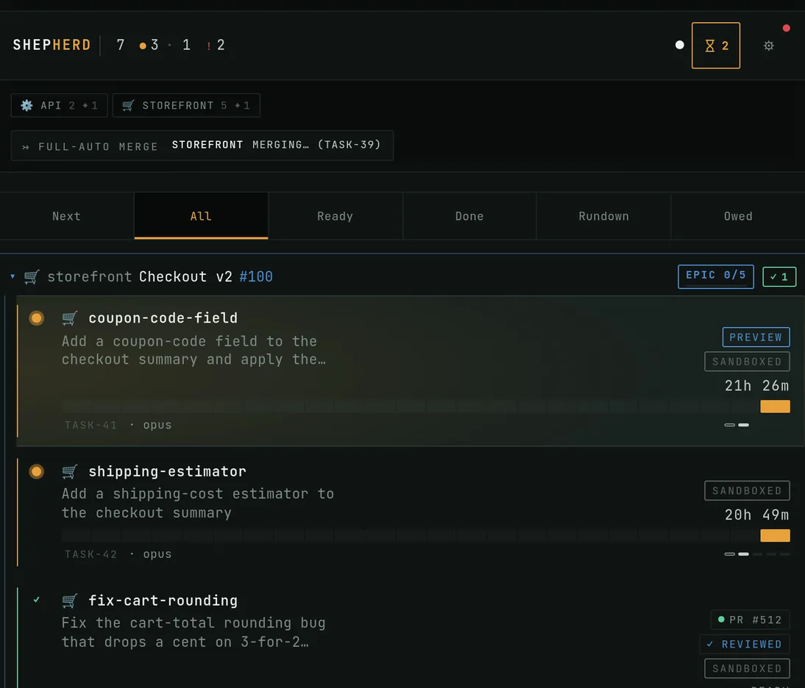

# Shepherd

**Ship more with AI coding agents. Spend less time managing them.**

Shepherd brings your coding agents, tasks and pull requests into one place. See what's moving,
what needs you and what's ready to ship — from your browser, phone, or the new **native macOS app**.

**[Get started](docs/getting-started.md)** · **[Shepherd for Mac](native/README.md)** ·
[Website](https://shepherd.run) · [Documentation](https://docs.shepherd.run)

  

## More agents should mean more progress

One coding agent is easy to follow. Several can leave you juggling terminals, checking whether
someone is stuck and piecing together which changes are ready. Shepherd gives you a shared view
of that work, so you can spend your attention on decisions.

- **Know where you're needed.** See running, waiting and finished sessions together; open the
  conversation and steer an agent when it needs direction.
- **Move several tasks forward at once.** Give each agent its own workspace and keep each task's
  progress, changes and pull request connected.
- **Review before you ship.** Plan review, an independent code critic and a merge train help
  catch weak plans, unresolved findings and stale branches before they land.
- **Keep your workflow.** Work with real interactive Claude Code sessions, your existing commands,
  skills and plugins. Codex CLI support is available in alpha.
- **Stay in control.** Run Shepherd on your own server with your own agent login. Check progress
  at your desk or from your phone, and choose how much work to automate.

## From an idea to a reviewed pull request

Describe a task or pick an issue. Shepherd gives the agent a workspace, keeps its progress visible
and brings the resulting pull request back into the same workflow. Inspect changes, open a live
preview or send more direction while the agent works.

When you're ready for more automation, queue work and let agents pick it up within your configured
limits. Plan gates challenge the approach before implementation; the Critic reviews the result;
and the merge train checks that a pull request is current, conflict-free and CI-green before it
lands. You choose which automation to enable for each repo.

  <video
    src="https://github.com/user-attachments/assets/bb88eabc-fdb5-4ff1-bec8-cf9c859d01e9"
    poster="docs/media/shepherd-explainer-poster.png"
    controls
    muted
    width="720"
  ></video>
   
  <em>▶ 30-second explainer — how a task moves from issue to merge, and why it stops
  (<a href="docs/media/shepherd-explainer.mp4">download</a> ·
  <a href="docs/media/shepherd-explainer.en.srt">captions</a> ·
  <a href="docs/media/explainer/">source</a>).</em>

## Your agents, now at home on your Mac

**Shepherd for Mac is our native macOS app.** Follow your sessions, inspect diffs and files, review
pull requests and talk to agents through a live terminal — in a dedicated Mac workspace with
native notifications.

The app connects to a Shepherd server on your Mac or a remote machine. It's an early preview,
already useful for daily work, with broader workflow coverage still available in the web UI.
Currently, you build it from source.

**[Explore Shepherd for Mac →](native/README.md)**

## Built for the way you work

| When you want to…                  | Shepherd helps you…                                                            |
| ---------------------------------- | ------------------------------------------------------------------------------ |
| Make progress across several tasks | Run agents in parallel and see their status in one place.                      |
| Spend less time chasing updates    | Find sessions that need attention and inspect their work directly.             |
| Delegate without losing oversight  | Review plans and changes, steer live sessions and control automation per repo. |
| Carry lessons into the next task   | Turn approved learnings into repo rules for future sessions.                   |
| Step away from your desk           | Follow the same work from the browser on your phone.                           |

Shepherd is actively developed and used in production by its authors. The browser experience
has the broadest feature set; the native Mac app is catching up. Linux is the fully supported
server platform; hosting the server on macOS currently has
[reduced capabilities](docs/getting-started.md#os-matrix).

## Take the next step

- **[Start with Shepherd](docs/getting-started.md)** — installation, supported platforms and first login.
- **[Use the Mac app](native/docs/getting-started.md)** — build, connect and find your way around.
- **[Read the user docs](https://docs.shepherd.run)** — workflows and feature guides.
- **[Ask a question or share an idea](https://github.com/erwins-enkel/shepherd/discussions)** — help shape what comes next.

## Technical details

[Configuration and integrations](docs/configuration.md) ·
[Deployment, previews and operations](docs/operations.md) ·
[Architecture and development](docs/development.md) ·
[Contributing](CONTRIBUTING.md) · [Product vision](PRD.md) ·
[Open issues](https://github.com/erwins-enkel/shepherd/issues)

Shepherd is powered by [herdr](https://herdr.dev), the interactive agent multiplexer by
[Can Celik](https://github.com/ogulcancelik). herdr keeps agent sessions running across Shepherd
restarts. Thank you, Can.

## License

[Business Source License 1.1](./LICENSE) © 2026 Erwins Enkel GmbH

Shepherd is **source-available**, not open source. You may read, modify, and make
non-production use freely, and production use is permitted **except** offering
Shepherd to third parties as a competing hosted or embedded commercial service
(see the Additional Use Grant in [`LICENSE`](./LICENSE)). Each version converts to
the [Apache License 2.0](https://www.apache.org/licenses/LICENSE-2.0) **four years
after that version is published** (its Change Date). For other arrangements,
contact Erwins Enkel GmbH.
