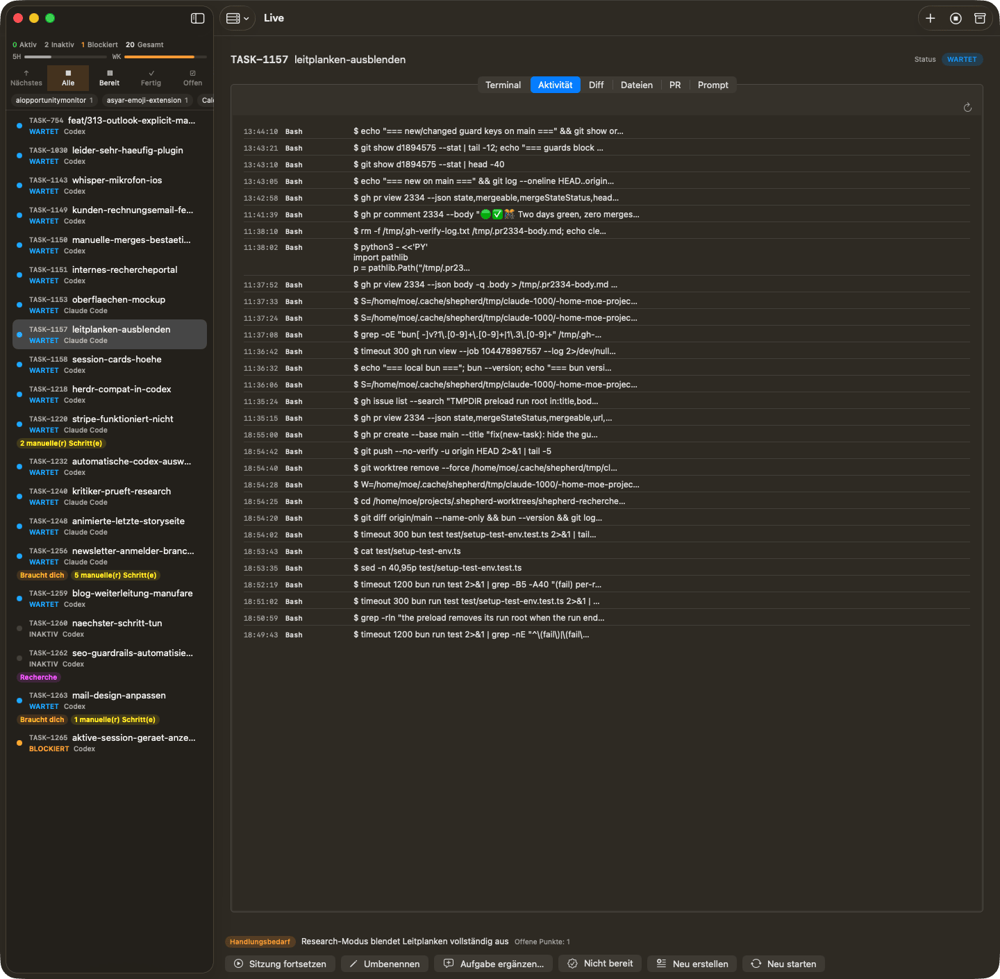

# Shepherd for Mac

**Your AI coding agents. One native Mac workspace.**

Keep parallel coding work in view without hunting through terminal windows and browser tabs.
Shepherd for Mac brings your sessions, code changes and pull requests together, so you can see
what needs attention and give your agents direction.

**[Get started →](docs/getting-started.md)** · [See more screenshots](docs/screenshots.md) ·
[Discover Shepherd](../README.md)

## Less chasing. More deciding.

- **See the work at a glance.** Browse your sessions, filter by repo or state and keep usage in view.
- **Understand what changed.** Read an agent's activity, inspect its diff and browse its files in
  the same workspace.
- **Give direction when it matters.** Attach to the live terminal, send a message and take the
  session actions you need.
- **Keep the pull request close.** Check its state and checks, request a review or merge without
  losing the context of the task.
- **Let the app call you back.** Native notifications help you follow work while your attention
  is elsewhere.

## A Mac workspace for your Shepherd server

Use a server on your Mac or connect to a remote one. If your agents run on a Linux machine, the
Mac app gives you a native place to follow and steer that work. Your existing Shepherd sessions
are there when you connect.

The app is a client for Shepherd: it needs a running Shepherd server. The server runs the agents;
the app is where you see their progress, inspect results and make decisions.

## Early, useful and growing

The app is an **early preview**, already usable day to day. Session filters, the live terminal,
activity, diffs, files, pull-request actions, the local-server panel and native notifications
are available today. The interface supports English and German; the screenshots show a live
instance in German.

The web UI still has broader coverage. Herd lifecycle stages, plan gates, merge automation and
the full new-task composer are being brought to the Mac app. Use the browser for workflows the
native app doesn't cover yet.

**Current availability:** macOS 15 or newer; [download the tester DMG](docs/app-updates.md#first-installation)
or build from source with Xcode. The
[getting-started guide](docs/getting-started.md) covers requirements and setup. Connecting to a
remote Linux server gives you the fully supported server platform; running the server on a Mac
has [reduced capabilities](../docs/getting-started.md#os-matrix).

## Make it your workspace

**[Get started with Shepherd for Mac →](docs/getting-started.md)**

Explore the [screenshot tour](docs/screenshots.md),
[share feedback](https://github.com/erwins-enkel/shepherd/discussions) or
[report an issue](https://github.com/erwins-enkel/shepherd/issues).

Tester distribution: [automatic app updates and release setup](docs/app-updates.md).

For contributors: [build, test, signing and architecture](docs/development.md), including
[ShepherdKit](docs/development.md#shepherdkit), the Swift client package behind the app.
