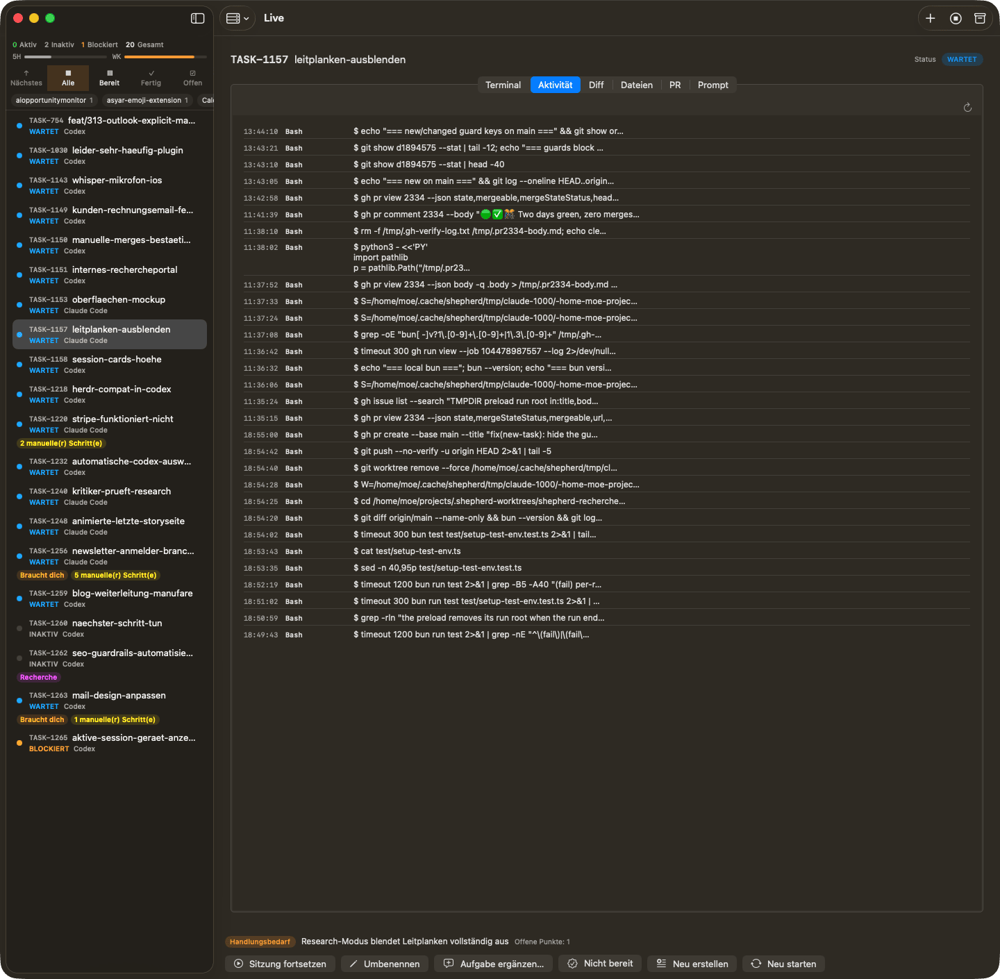

# Shepherd for Mac

**Your AI coding agents. One native Mac workspace.**

Keep parallel coding work in view without hunting through terminal windows and browser tabs.
Shepherd for Mac brings your sessions, code changes and pull requests together, so you can see
what needs attention and give your agents direction.

**[⬇ Download for macOS](https://github.com/erwins-enkel/shepherd/releases?q=macos-)** · [Get started →](docs/getting-started.md) ·
[See more screenshots](docs/screenshots.md) · [Discover Shepherd](../README.md)

## Less chasing. More deciding.

- **See the work at a glance.** Browse your sessions, filter by repo or state and keep usage in view.
- **Understand what changed.** Read an agent's activity, inspect its diff and browse its files in
  the same workspace.
- **Give direction when it matters.** Attach to the live terminal, send a message and take the
  session actions you need.
- **Keep the pull request close.** Check its state and checks, request a review or merge without
  losing the context of the task.
- **Let the app call you back.** Native notifications help you follow work while your attention
  is elsewhere.

## A Mac workspace for your Shepherd server

Use a server on your Mac or connect to a remote one. If your agents run on a Linux machine, the
Mac app gives you a native place to follow and steer that work. Your existing Shepherd sessions
are there when you connect.

A local server started by the app keeps running when you quit or restart the app, including
automatic updates and dev rebuilds. The next launch resumes supervision. Use **Stop** or
**Restart** in **Run on this Mac** to control the server. A dev rebuild retains the running
server code; **Restart** explicitly loads the updated code.

Ownership and private logs in `~/.shepherd/run/` are scoped by port and canonical installation
and database paths. Adoption and every signal validate the kernel process start time, so a
reused PID cannot grant ownership. Generated boot passwords use a separate 0600 one-shot file,
read and removed by the app, and never enter the server log. If the app quits during boot, the
next adoption removes that file without offering the old password again.

Logs use append mode and copy-truncate at 10 MiB on spawn, adoption and while the app observes
the server; the previous copy is capped at 10 MiB. The tail follows truncation and file
replacement. While the app is closed, log growth is bounded only at the next app start.
Continuous maintenance while closed would require an additional persistent logging service.
Older running apps still stop their server on quit: the dev preflight retains its live-session
checks unless the running app has a matching live ownership record.

The app is a client for Shepherd: it needs a running Shepherd server. The server runs the agents;
the app is where you see their progress, inspect results and make decisions.

## Early, useful and growing

The app is an **early preview**, already usable day to day. Available today:

- **Sessions:** the herd sidebar with task descriptions, runtime model and effort, lifecycle
  stages, repo and state filters and usage meters. Cards open task details, review results and
  session actions, and flag costly resumes after the prompt cache expires.
- **Session detail:** activity, diff, files, git and the live terminal.
- **Review and merge:** plan gates, pull-request actions, review requests and merge automation.
- **Starting work:** a new-task composer that starts from an issue, plus held tasks, Up Next and
  the Done panel.
- **Around the app:** a command palette, the local-server panel and native notifications.

The interface supports English and German; the screenshots show a live instance in German.

The backlog, epic management and learnings are still web-only. Use the browser for those.

## Download and install

Requires **macOS 15 or newer**.

1. Open the [Mac releases](https://github.com/erwins-enkel/shepherd/releases?q=macos-) and pick the newest **Shepherd for Mac** release.
2. Download `Shepherd-<build>.dmg`, open it and drag **Shepherd.app** onto the Applications shortcut.
3. Open Shepherd from Applications and confirm macOS's “downloaded from the internet” prompt.
   The app is signed with Developer ID and notarized by Apple.

After that, updates arrive automatically. Details: [first installation](docs/app-updates.md#first-installation).
Prefer to build it yourself? The [getting-started guide](docs/getting-started.md) covers building
from source with Xcode and connecting to a server. Connecting to a remote Linux server gives you
the fully supported server platform; running the server on a Mac has
[reduced capabilities](../docs/getting-started.md#os-matrix).

## Make it your workspace

**[Get started with Shepherd for Mac →](docs/getting-started.md)**

Explore the [screenshot tour](docs/screenshots.md),
[share feedback](https://github.com/erwins-enkel/shepherd/discussions) or
[report an issue](https://github.com/erwins-enkel/shepherd/issues).

Tester distribution: [automatic app updates and release setup](docs/app-updates.md).

For contributors: [build, test, signing and architecture](docs/development.md), including
[ShepherdKit](docs/development.md#shepherdkit), the Swift client package behind the app.
