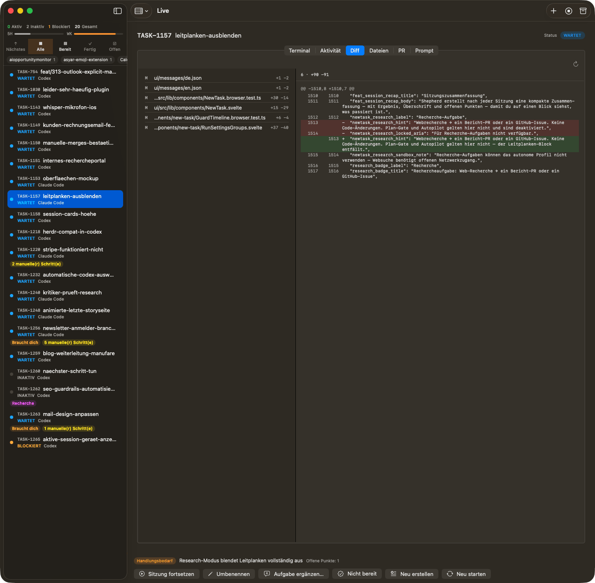
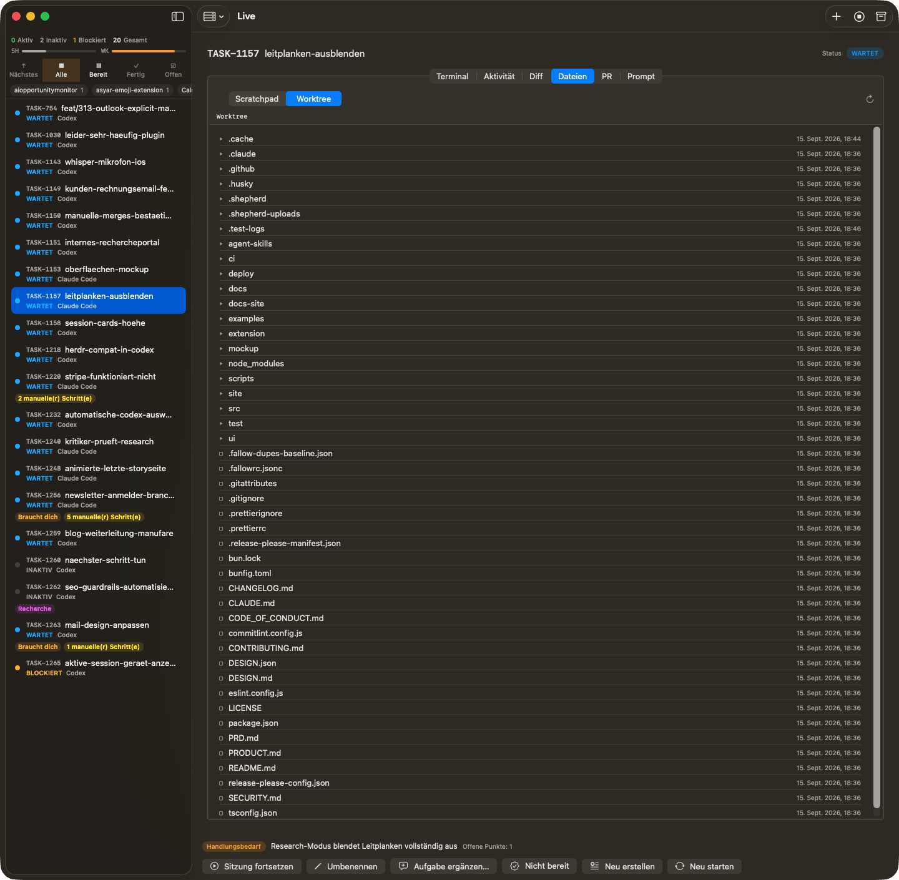
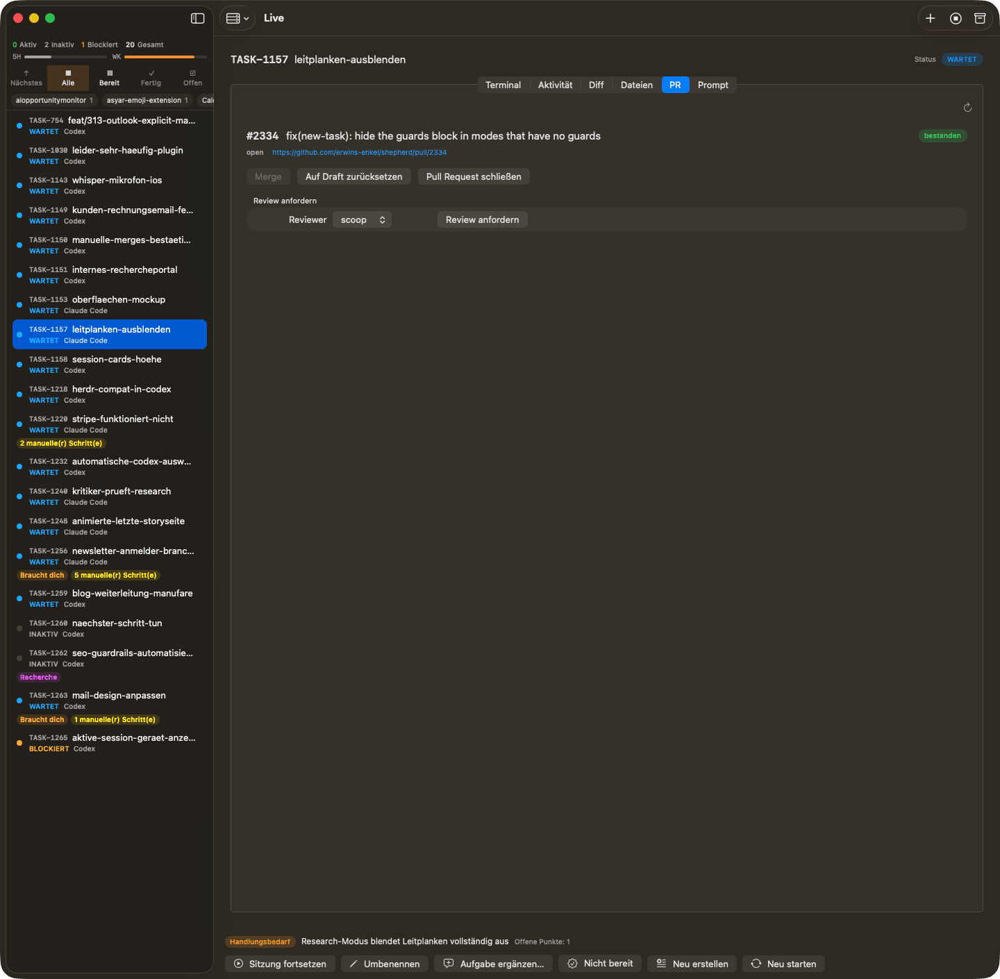
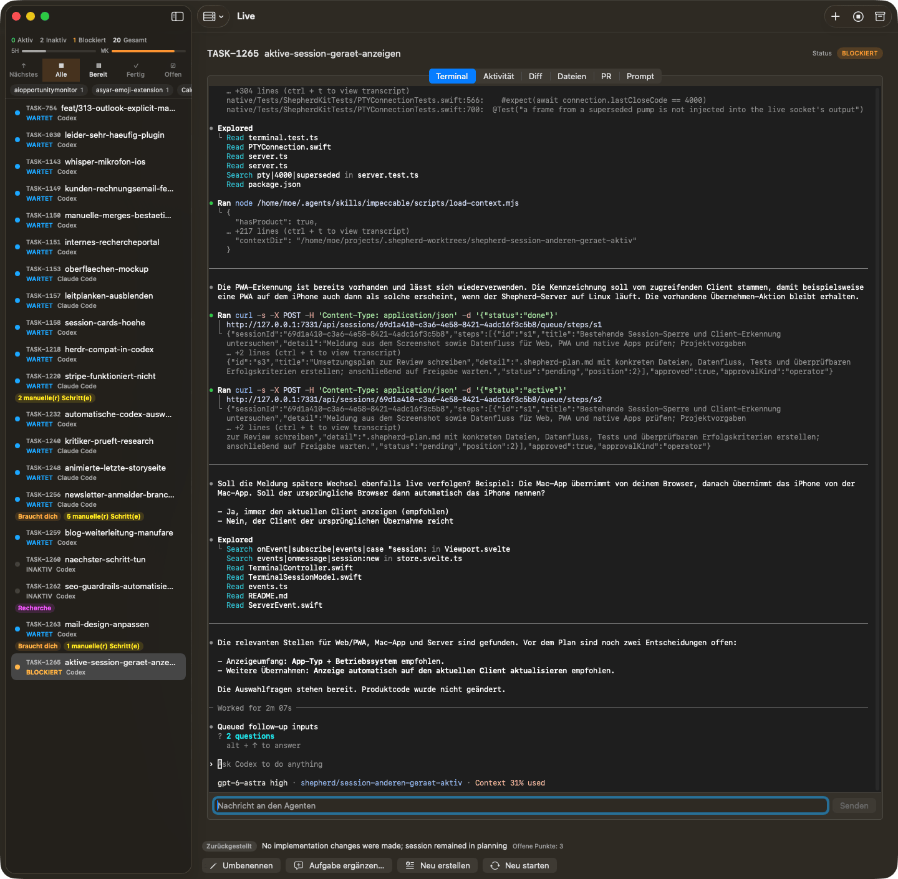
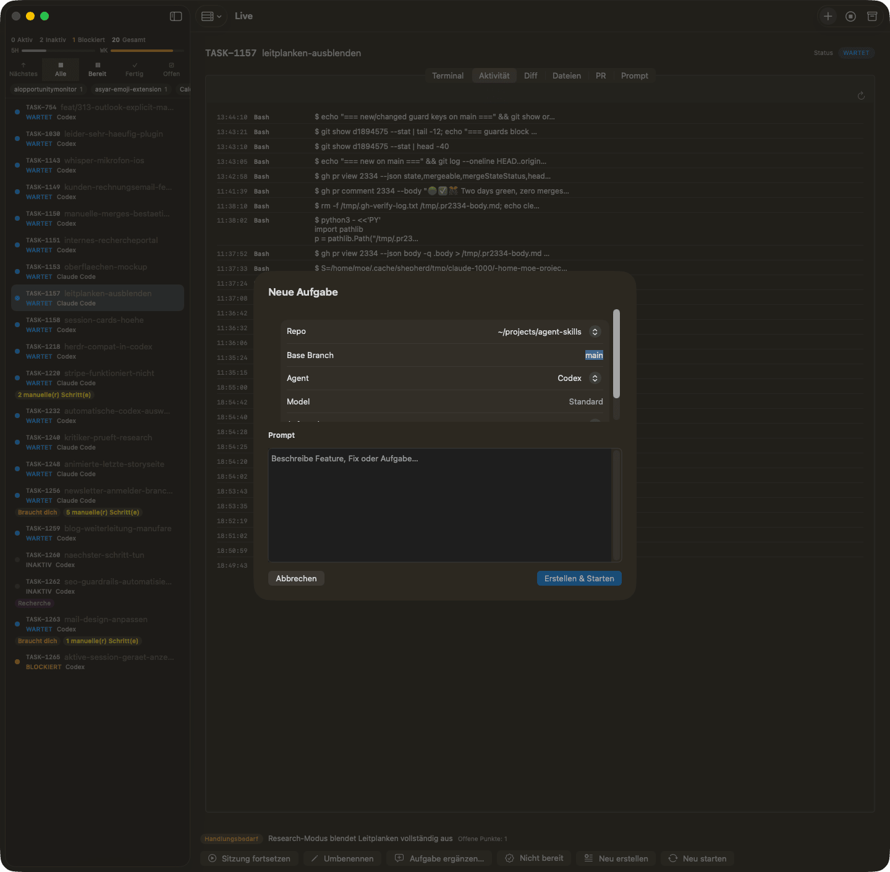
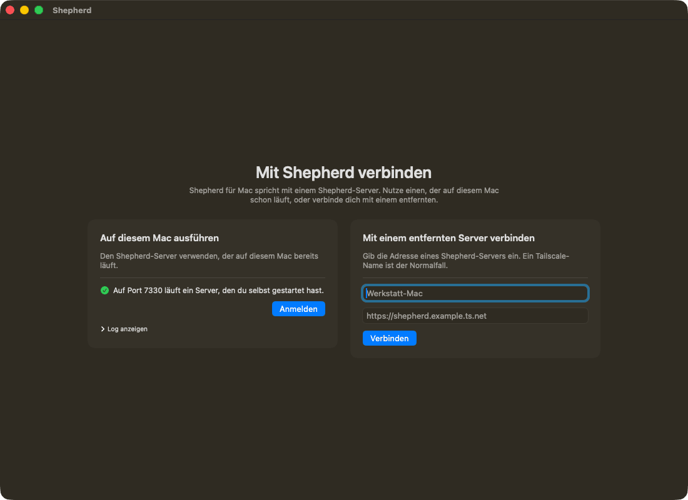

# Shepherd for Mac — screenshots

[← Shepherd for Mac](../README.md) · [Get started](getting-started.md) · [Development](development.md) · [Screenshots](screenshots.md)

Screenshots from a live instance with real sessions — German UI, dark appearance.

_Sidebar: herd counters, the usage windows, the view and repo filters, and every session with its
state. The detail pane shows the selected session's Activity — what the agent actually ran._

_Diff against the base branch: changed files with their line counts on the left, the selected
file's hunks on the right._

_Files: the session's scratchpad and its worktree, browsable without leaving the app._

_Pull request: number, title, state, check result, and the merge, draft, close and review-request
actions._

_Terminal: the session's terminal with its scrollback, attached live, and a message box for the
agent._

_Below the detail pane: the recap — status badge, one-line summary, open points — and the
actions that apply to this session._

_Starting a new task: repo, base branch, agent, model and the prompt._

_First launch: use the Shepherd server already running on this Mac, or connect to a remote one._
